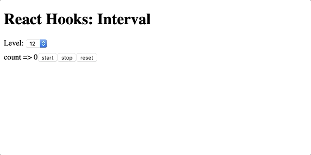

# The Iceberg of React Hooks

## 소개
React Hooks는 클래스 컴포넌트와 다르게 기본적인 코드만으로 어플리케이션에 필요한 요소 구성, 코드의 재사용 등을 간단하게 이뤄냅니다.

하지만, 잘 모르고 사용할 경우 파악하기 어려운 버그들이나 성능 문제가 발생할 수 있습니다.

이 글에서는 Hook에서 발생하는 일반적인 문제들과 해결방법 12가지를 준비했습니다.

* * *

## 목표
목표는 500ms마다 증가하는 카운터를 만드는 것입니다.
는
start, stop, clear 세가지 버튼이 구현되어야합니다.



* * * 

## Level 00: Hello World
```javascript
// levels/level00.js
import React, { useState } from 'react';

export default function Level00() {
  const [count, setCount] = useState(0);

  return (
    <div>
      count => {count}
      <button onClick={() => setCount(count + 1)}>+</button>
      <button onClick={() => setCount(count - 1)}>-</button>
    </div>
  );
}
```
`useState`를 이용해서 구현된 간단한 카운터입니다.   
각 버튼을 이용해 count를 올리거나, 내릴 수 있습니다.

## Level 01: setInterval
```javascript
// levels/level01.js
import React, { useState } from 'react';

export default function Level01() {
  const [count, setCount] = useState(0);

  setInterval(() => {
    setCount(count + 1);
  }, 500);

  return <div>count => {count}</div>;
}
```
위 코드는 500ms마다 카운터를 올리기 위해 작성되었습니다.   
하지만, 의도와는 다르게 랜더링이 발생할 때마다 새로운 인터벌이 작성됩니다.  

함수형 컴포넌트 자체에서는 뮤테이션, 구독, 타이머, 로깅 및 기타 Side effect가 허용되지 않습니다([UseEffect](https://reactjs.org/docs/hooks-reference.html#useeffect, "useeffect link"))

## Level 02: [UseEffect](https://reactjs.org/docs/hooks-reference.html#useeffect, "useeffect link")
```javascript
// levels/level02.js
import React, { useState, useEffect } from 'react';

export default function Level02() {
  const [count, setCount] = useState(0);

  useEffect(() =>
    setInterval(() => {
      setCount(count + 1);
    }, 500);
  });

  return <div>count => {count}</div>;
}
```
대부분의 Side effect는 [UseEffect](https://reactjs.org/docs/hooks-reference.html#useeffect, "useeffect link") 내에서 행해집니다. 하지만 이 코드도 랜더링이 발생할 때마다 새로운 인터벌이 작성되고, 결과적으로 리소스 낭비가 일어납니다.


## Level 03: run only once ([Timing of Effect](https://reactjs.org/docs/hooks-reference.html#timing-of-effects))
```javascript
// levels/level03.js
import React, { useState, useEffect } from 'react';

export default function Level03() {
  const [count, setCount] = useState(0);

  useEffect(() => {
    setInterval(() => {
      setCount(count + 1);
    }, 300);
  }, []);

  return <div>count => {count}</div>;
}
```
`useEffect`에 `[]`를 두번째 인수로 지정할 경우 컴포넌트 마운트 이후 함수가 한번만 호출됩니다.

하지만, 결과적으로 count는 0에서 1로 증가한 뒤 유지됩니다.   
화살표 함수 역시 첫 사이클 한번만 생성되며 이 때의 count는 0으로 `setCount(1)` 이 계속해서 호출되기 때문입니다.

또한, 이 코드는 컴포넌트를 마운트 해제한 이후에도 계속해서 `setCount`가 호출되는 리소스 낭비가 있습니다.


## Level 04: cleanup ([Cleaning up an effect](https://reactjs.org/docs/hooks-reference.html#cleaning-up-an-effect))
```javascript
// levels/level04.js
...

  useEffect(() => {
    const interval = setInterval(() => {
      setCount(count + 1);
    }, 300);
    return () => clearInterval(interval);
  }, []);

...
```
리소스 낭비를 없애기 위해서는 생명주기가 끝날 때 모든 effect를 정리해야합니다.   
구독 또는 타이머 같은 리소스는 `useEffect`에서 사용한 뒤 clean-up function을 반환해야합니다.

다만, 리소스 낭비가 해결되었을 뿐 `count`는 1로 변한채 계속 유지됩니다.


* * * 
## 출처
> 원글: https://medium.com/@sdolidze/the-iceberg-of-react-hooks-af0b588f43fb 